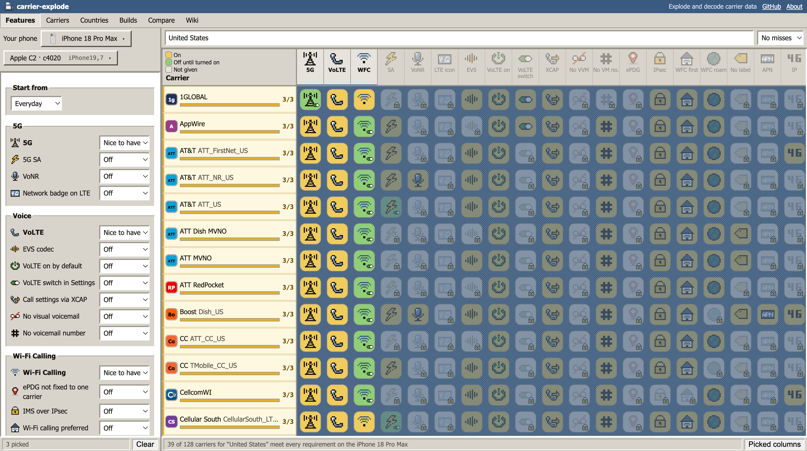
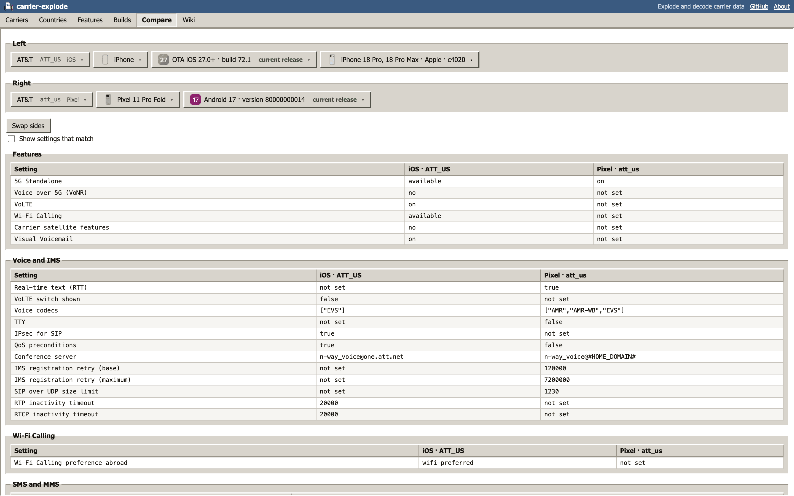
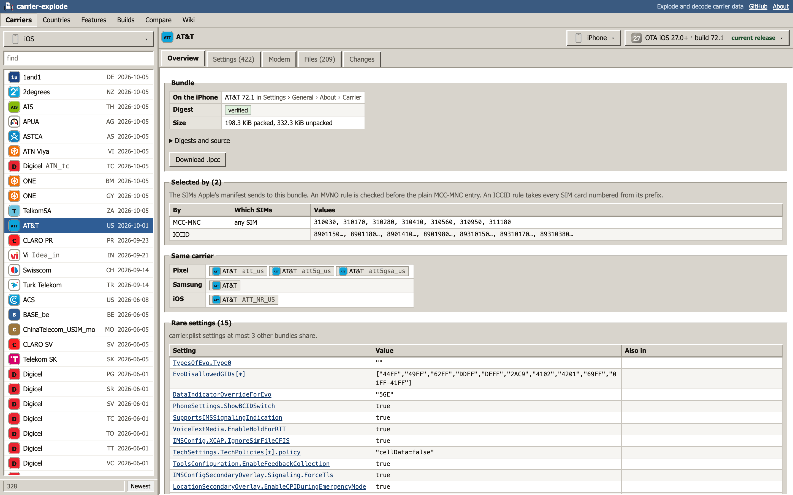
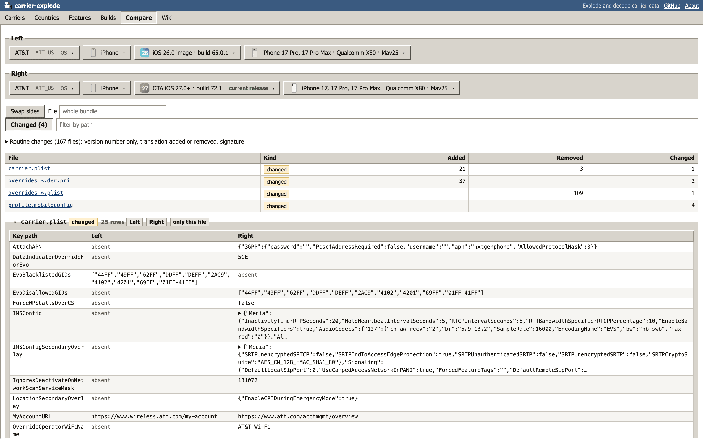
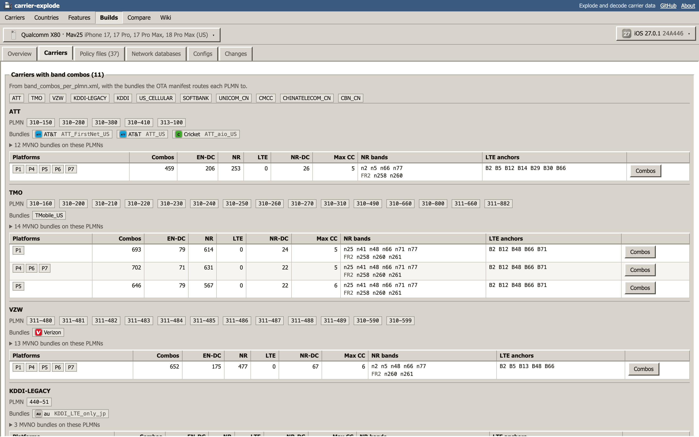

<p align="center">
  
</p>
<h1 align="center">carrier-explode</h1>

Carrier settings from iPhone, Pixel and Galaxy firmware, decoded and compared: [carrierexplode.com](https://carrierexplode.com), with a free JSON API at [api.carrierexplode.com](https://api.carrierexplode.com/v1).

## Why

I started this while chasing how iOS handles cell broadcast for Indian carriers, and which emergency alerts they add. Answering it meant digging through CommCenter and carrier bundles by hand, which got old fast, so I built a small viewer. One thing led to another, and it became carrier-explode.

## What you can do with it

- Pick the features you need (5G SA, VoNR, Wi-Fi Calling and more) and see which carriers give them on your phone.
- Look up a carrier and see its settings on each platform: APNs, VoLTE, Wi-Fi Calling, 5G and the rest, per phone.
- Compare any two versions of a carrier's settings, or two carriers, and see what a given OS release changed.
- Find which settings a SIM selects from its MCC/MNC, GID1/GID2, SPN, IMSI or ICCID (API).
- Read each build's modem configurations and band combinations.
- Get all of it as JSON from the API.
- Download everything as a daily CC0 zip: [dataset](https://carrierexplode.com/wiki/datasets).

## Screenshots











## Where the data comes from

All of it is read from the vendors' own public downloads:

- **iPhone:** carrier and country bundles from iOS restore images (IPSWs), plus Apple's over-the-air carrier bundle updates. iPad and Apple Watch bundles come from the OTA updates only.
- **Pixel:** CarrierSettings and modem configurations from Google's full OTA images, plus the carrier settings updates Google serves between builds.
- **Galaxy:** CSC/OMC carrier packs, IMS settings and modem firmware from Samsung's firmware server, for the US models Google Play lists as supported.

The site and API publish decoded data, plus the images and audio Apple's bundles embed; never vendor files as they are.

### Scope

- iPhone 15 and later, iOS 18 and later, including betas of the newest major release.
- Pixels since October 2020.
- US Galaxy S, Z Fold and Z Flip models launched since 2025, across their last three major Android releases.

Scope only limits what new builds are read; nothing already indexed is dropped.

## How it works

Everything runs on Cloudflare:

- **Ingest:** a Workflow per build fetches and decodes it. Containers are used only where a Worker can't do the job: an iOS root filesystem and a Galaxy system partition.
- **Storage:** R2 holds every file once, by content hash, along with its normalized form and a record of each build.
- **Index:** each new record goes through a queue whose consumer derives carriers, timelines and feature states into a D1 database.
- **Serving:** the site (SvelteKit) and API read D1 and R2. Their answers are cached at the edge and purged when the index changes.

It is very cheap to run: containers only spin up for a new build, and everything else is Workers, R2 and D1.

The full design is in [docs/architecture.md](docs/architecture.md), and the [wiki](https://carrierexplode.com/wiki) explains each part.

## Layout

A pnpm workspace:

- `apps/site`: the SvelteKit Worker.
- `apps/api`: the API Worker.
- `apps/extractor`: the ingest Worker, its Workflows and its container.
- `packages/decode-*`: the decoders (iOS, Android, Samsung, and Qualcomm, Shannon and MediaTek modems).
- `packages/schema`: the platform-neutral model; the only package that sees every decoder.
- `packages/db`, `packages/storage`, `packages/firmware`: the D1 schema and queries, the R2 layout, and firmware readers.
- `docs/`: the [architecture](docs/architecture.md) and the [API](docs/api.md).
- `tools/`: standalone research tools for firmware formats.

## Development

```sh
pnpm install
pnpm check   # types, lint, format and package rules
pnpm test
pnpm dev     # the site, against a local (empty) dev index
```

## Contributing

Anyone is welcome to contribute, learn from it, and help decode. Plenty of fields are still unknown. What is known so far is in the [wiki](https://carrierexplode.com/wiki) and the decoders' field tables.

## License

[MIT](LICENSE).

## Prior art and credits

- [zacharee/SamloaderKotlin](https://github.com/zacharee/Bifrost) (now Bifrost, MIT): the Samsung firmware server client, ported.
- [GrapheneOS/adevtool](https://github.com/GrapheneOS/adevtool): the Pixel carrier settings update request.
- [blacktop/go-apfs](https://github.com/blacktop/go-apfs): reading iOS root filesystems.
- [fei-ke/OmcTextDecoder](https://github.com/fei-ke/OmcTextDecoder) (Apache-2.0): decoding Samsung's encoded pack files.
- [dwilliamsuk/ios-carrier-bundles](https://github.com/dwilliamsuk/ios-carrier-bundles): the IPSW extraction steps.
- [mast3rz3ro/imobilecfbm](https://github.com/mast3rz3ro/imobilecfbm), [mrlnc/ipcc-downloader](https://github.com/mrlnc/ipcc-downloader), [samsam123.name.my/ipcc](https://samsam123.name.my/ipcc/): downloaders over Apple's carrier bundle manifest.
- [The Apple Wiki: Carrier Bundle](https://theapplewiki.com/wiki/Carrier_Bundle).
- [JohnBel/EfsTools](https://github.com/JohnBel/EfsTools) and [fenrir-naru/mbn_utils](https://github.com/fenrir-naru/mbn_utils): Qualcomm EFS and NV names. 3GPP TS 23.041 and 3GPP2 C.S0016 for the spec-defined formats.
