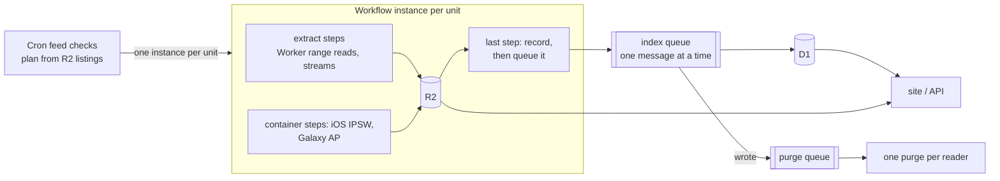

# Ingest and index

The extractor Worker (`apps/extractor`) finds new builds and OTA files, extracts and normalizes their carrier files into R2, and indexes them into D1. The site (`apps/site`) and the API (`apps/api`) read D1 rows per request, and R2 for file views.

## Scope

`SCOPE` in `apps/extractor/wrangler.jsonc` (valibot schema in `src/scope.ts`) is an ingest filter, never retention: it decides which new builds are scanned, and nothing indexed is deleted. Phone states are derived for every phone an indexed release lists.

- **Devices**: a release-day cutoff (`releasedSince`) or a list of `codes` (the dev environment's one phone a family).
- **`everythingSince`**: from this day every build is taken. Before it, `backfill` thins history: `releases` (iOS: every release, and the newest major's betas), `quarterly` (Pixel: each phone's newest build of each train) or `newest`.
- **iOS `minMajor`**: no build of an older major (18: iOS 17's root images are UDIF images apfs-extract cannot read).
- **Galaxy** `families`, `exclude`, `releasedSince`: the US models Google Play lists whose name starts with a family and has no `exclude`, launched (oldest `version.xml` build) since `releasedSince`. For each of the newest `majors` majors, each model's newest build, on each family's newest generation (the number in its name) that has it.
- **Apple OTA**, per platform: `all`, `current` (each source's file for the newest OS it is listed for, no prerelease), `none`, or for iOS some `phones` on the newest `majors` majors.

Each family's planner is a pure function of the feed's builds, the held record keys, the scope and today.

## Units

One Workflow per pipeline (`src/pipelines.ts`), one instance per unit, named by the unit (`galaxy-build-S942UOYN4BZID`), so a unit is never started twice; a held iOS build's name adds a digest of the phones its record holds (`ios-build-24A446-1c2d3e4f`), so a phone listed later for it plans the whole build again, and a build has one live instance however its IPSWs change while it runs. Planning compares the feed against **R2 key listings**, never D1. A check creates the units it plans with `createBatch`; no Workflow starts another.

| Pipeline (unit)                             | Discovered from                                              | Held when listed                                                             |
| ------------------------------------------- | ------------------------------------------------------------ | ---------------------------------------------------------------------------- |
| `ios-build` (a build: its in-scope IPSWs)   | ipsw.me, AppleDB for betas                                   | `releases/ios/<build>.json`, its `phones` metadata naming every listed phone |
| `apple-ota` (manifest snapshot)             | Apple's OTA carrier manifest                                 | `ota/apple/files/<urlhash>.json`                                             |
| `pixel-device` (one Pixel's OTA of a build) | Google's Pixel OTA page and source.android.com build numbers | `releases/android/<build>/<device>.json`                                     |
| `pixel-ota` (answer snapshot)               | Pixel carrier-settings update service                        | `ota/pixel/files/<urlhash>.json`                                             |
| `galaxy-build` (one model's firmware)       | Google Play's device list and Samsung `version.xml`          | `releases/samsung/<build>.json`                                              |
| `labels` (a week)                           | codes with no name                                           | —                                                                            |
| `dataset` (a day)                           | the public API, over a service binding                       | `datasets/carrier-explode.zip`, its date, sha256 and size as metadata        |
| `reindex` (a record, or all held records)   | by hand, after a schema bump or a lost index                 | —                                                                            |

Crons (production): `*/20 * * * *` iOS builds (a check starts builds up to its `CONTAINER_SHARE` of live ones; the next check, up to 20 minutes later, starts more if any ended), `10,30,50 * * * *` Galaxy builds (the same, on its own minutes), `35 3 * * *` Pixel builds, `7 */6 * * *` OTA feeds, `17 4 * * 1` labels, `50 3 * * *` the dataset. `POST /run` starts a check, a reindex or a rederive by hand; `GET /runs/:id` is an instance's Workflow status.

A modem summary holds only what the package does, its band-combination tags with their PLMNs; the bundles Apple's manifest routes those PLMNs to are read from `routes` per request (`routedBundles`), so iOS builds and the manifest index in any order. The Pixel OTA check asks the update service about each held Pixel's newest train, so it plans nothing before a Pixel release is held.

An iOS build is one unit, not one per IPSW: each IPSW carries only its own phones' override files, so a source's copies are merged across the build's IPSWs before indexing, and one content per source reaches the main line.

## Steps

Every step runs in the Worker (`limits.cpu_ms` 300000, 128 MB), reads remote files by HTTP Range and streams anything larger than memory. A step that would come near a limit is split; parts hand on through `tmp/<instance>/` and return only small lists. Only two jobs need a container:

- **iOS** `ipsw` (one container step per IPSW, in turn): the root `.dmg.aea` decrypted to disk, `apfs-extract` copies the bundles to `tmp/`; modem packages go to `obj/`, their summaries to `decoded/`. Then `merge` (Worker) merges each source's copies, normalizes them and writes the release.
- **Galaxy** `csc` (packs per sales code to `tmp/`), `cp` (`modem.bin.lz4` streamed through LZ4 into the FAT reader, MCFG configs normalized), `ap` (container: the `system` partition's IMS maps per sales code), `release`.
- **Pixel** `plan`, `settings` (CarrierSettings, `others.pb` split, `carrier_list.pb`), `modem items` (Shannon item table), `modem`, `normalize …` steps from `obj/`, `release`.
- **OTA feeds** `plan`, one `file …` step per new file, `pointer`.

Containers (`src/container.ts`): one class, one awaited `run(job)` RPC per step attempt, each attempt in a container of its own, destroyed once it answers or at the job's deadline (inside the step's timeout); the container reaches the bucket through the Worker (`src/bucket-proxy.ts`) and answers whether a failure is permanent. A check starts container pipelines only up to their `CONTAINER_SHARE` of `max_instances`; nothing polls for a free container.

What each artifact kind normalizes to is one table (`src/normalize.ts`): a settings file to a Profile, a modem configuration to a ModemConfig with its base and band-combination lists, firmware packages and carrier lists to nothing. A normalized object is read from its artifact's bytes alone. SIM routing lives outside profiles: Apple's OTA manifest and a Pixel's `carrier_list.pb` become `routes` rows.

## R2: `carrier-explode-ingest`

Every key is spelled in `packages/storage/src/keys.ts`.

| Key                                         | What                                                                        |
| ------------------------------------------- | --------------------------------------------------------------------------- |
| `obj/<sha256>`                              | Artifact bytes, written once, `customMetadata.kind`                         |
| `norm/v
/<sha>.json`, `norm/v
/combos/` | Profile or ModemConfig; band-combination lists                              |
| `decoded/baseband/v<M>/<sha>.json`          | iOS modem package summary                                                   |
| `releases/<platform>/…json`                 | A unit's release record, written last                                       |
| `ota/{apple,pixel}/…`                       | Manifest snapshots, the current pointer, one record per file                |
| `firmware/samsung/<build>.json`             | What FUS said of a Galaxy build, so a check asks it once                    |
| `tmp/<instance>/…`                          | Hand-offs between a unit's steps; a lifecycle rule expires them after a day |

Content-keyed writes use `onlyIf: If-None-Match: *` with a `sha256` checksum. A Pixel or Galaxy step first asks D1 which shas it already holds and puts only the others.

## D1: `carrier-explode-index`

Schema: `packages/db/src/schema.ts`; migrations in `packages/db/migrations`.

- **Facts**, once per content sha or unit: `releases`, `modems`, `modem_configs`, `ota_files`, `copies`, `profiles`, `sims`, `routes`, `devices`.
- **Per source**, derived by `schema` for every source of a platform when it is derived again: `entries` (the version timeline), `sources` (`head_sha`; `base_sha`, the default.pb its newest phone reads it over; `updated`), `settings` and `concepts` (the head's leaves, diffed), `base_settings` (a default.pb's leaves, by sha: what a setting scan shows for a key the head leaves unset), `phone_states`, `changes`.
- **Linking**: `sources.carrier` and `carriers`, from every source's head identity and the people-written `links`.
- **Names**: `labels`, joined into queries; data first, labels only fill gaps.

Writers: the index queue's consumer writes everything derived. A feed check writes its platform's `devices` and their feed `labels`; a changed device (its release day orders heads, its boards pick iPhone phone states) queues `{kind: "rederive"}`, which derives every source and release change of its platform again, and any change purges the readers. The labels Workflow writes only names, and purges. A person's labels and `links` arrive by migration; after one that moves a device's release day or a link, `POST /run {run: "rederive", platform}`.

Countries, rarity, a carrier's platforms and its modem configurations (`sims` ⋈ `modem_configs`) are SQL at request time. One database: linking and the shared tables join across platforms.

## Indexing

A unit's last step writes its record and queues `{kind: "release"}`, `{kind: "ota", urls}` or `{kind: "routes"}` in the same step. The index queue's consumer (`src/indexing.ts`, `max_batch_size` 1, `max_concurrency` 1) writes the facts only, counts the message in `facts_written` (per platform) and sends `{kind: "settle", platform, facts}`, its number, an hour later. A settle message that is still its platform's last queues the platform's `rederive`; any other is dropped, as a later one covers it. So a burst of units is derived once, after the stream pauses for an hour (an iOS backfill's builds end at most a build, about 40 minutes, apart, so it derives at its end), and a new build an hour after it is indexed. A rederive hands derivation on in `derive` messages of 25 sources, every source some copy is of, then 25 releases' changes, so no invocation passes D1's 1,000 queries (`test/index-scale.test.ts`: a 900-source build's messages make 158 to 466). Facts that arrive between a rederive's messages send their own settle message, so another rederive follows. A message links carriers when a head identity changed, and the last message of a rederive's chain always links, so a link rule lands with any reindex. Every message writes only rows that differ, so messages may repeat or reorder. A message that wrote anything queues a purge. Every response a reader caches carries one tag, `index` (`INDEX_TAG`): every page shows lists of the whole index, and a link or a name shows in any response, so per-source tags would never spare a page. The purge queue's consumer purges that tag from each reader once a batch; the readers' cache purges share the account's Free-tier bucket of 25, refilled 5 a minute, and a batch refused 10 times is dead-lettered.

A reindex normalizes, from `obj/`, each artifact whose `norm/` object is missing (listings of `norm/v<PROFILE_SCHEMA>/` and `norm/v<MODEM_SCHEMA>/` find them; a held one is never rewritten), then indexes. `{run: "reindex", target: {kind: "release", …}}` or `{kind: "ota", …}` does one record, which is indexed as its unit's was. `{kind: "all", platform?}` (after a schema bump) is one instance: it normalizes every artifact the held records name that lacks its `norm/` object, each sha once, and only then queues a `{kind: "reindex", platform}` chain per platform, which writes one held record's facts a message, in key order, deriving nothing, and ends in that platform's `rederive`. A source's head and phone states read every record's copy of it, so none is derived before every record is normalized and its facts written.

## Failure

- A step throws: retried (`limit 3`, exponential from 10 s; container steps `limit 2`).
- `permanent()` (`src/errors.ts`) ends the instance with a `NonRetryableError`: a 4xx other than 408/429, a record that fails its schema or is not JSON, or any package reader's format or bounds error. The instance stays errored until `/run … rebuild`.
- An index message fails: retried 10 times, 5 minutes apart, then dead-lettered. Nothing requeues it: the error is in the Workers Logs and the message waits in the index dead-letter queue (`carrier-explode-index-dlq`), so a non-empty DLQ means a fix is due. Fix, deploy, then `POST /run` a reindex of the record (or of all, after a schema bump), or a rederive of its platform for a lost `derive`.
- A unit writes its record last and D1 only after, so a failed unit is neither held nor half-indexed; `obj/` and `norm/` writes are content-keyed, so a retry rewrites nothing.
